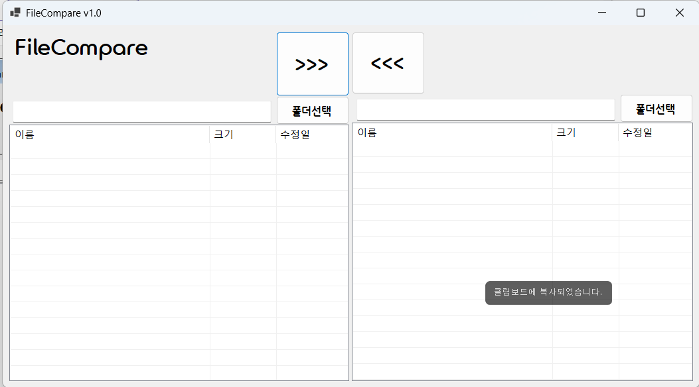
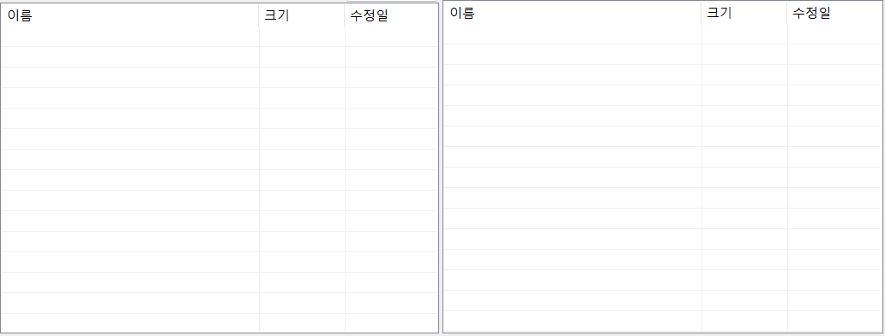
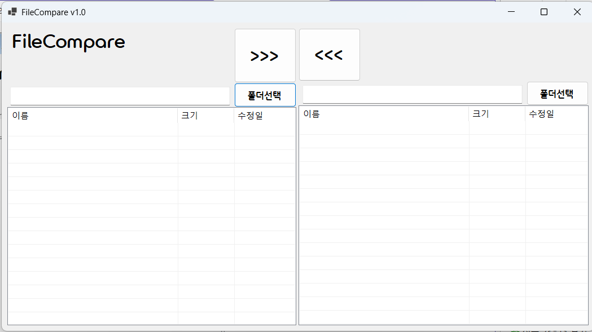
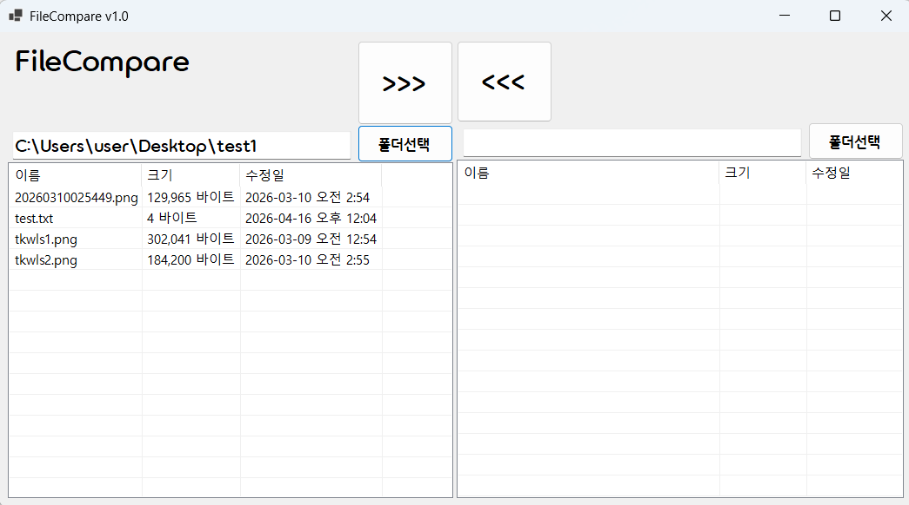
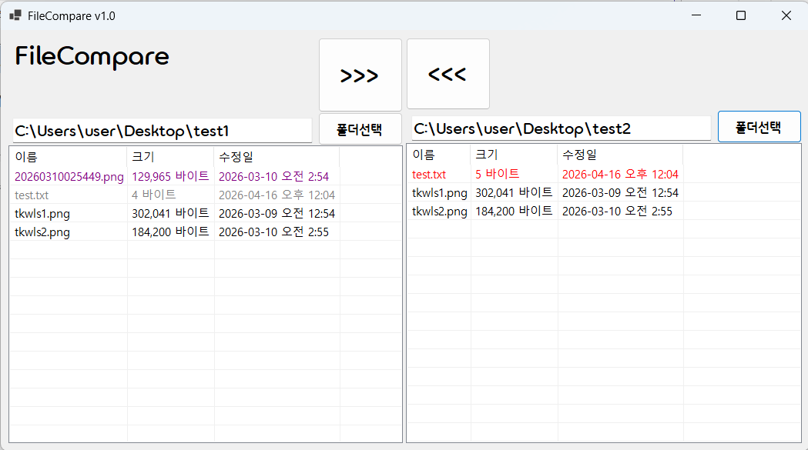
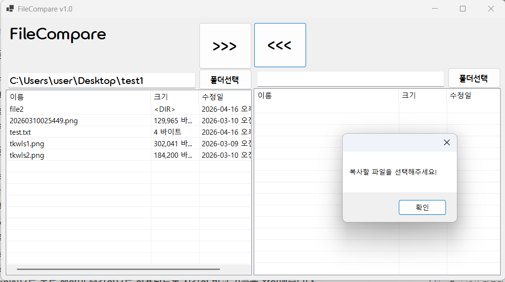
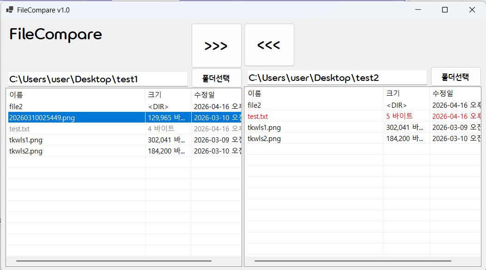
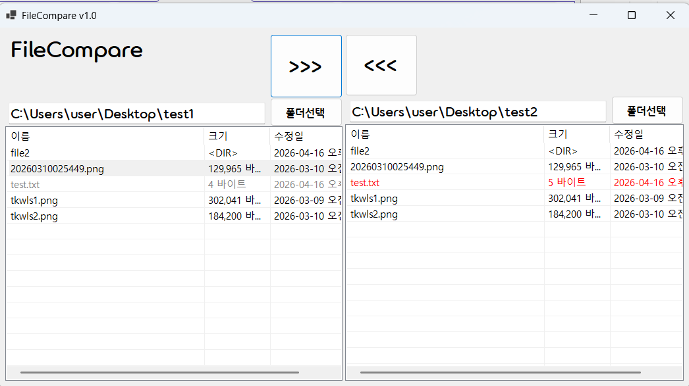
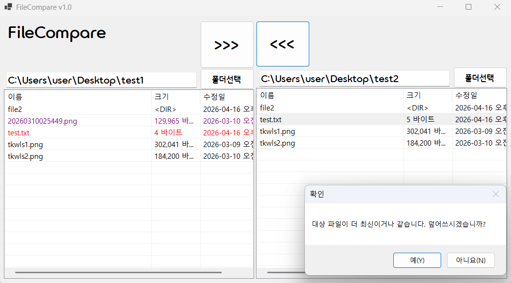

# (C# 코딩) 파일 비교 툴 (File Compare)

## 개요
- C# 프로그래밍 학습
- 1줄 소개: 두 개의 폴더를 선택하여 양쪽 파일의 수정 날짜를 비교하고, 최신 버전으로 안전하게 복사 및 덮어쓰기를 지원하는 반응형 파일 관리 프로그램
- 사용한 플랫폼:
  - C#, .NET Windows Forms, Visual Studio, GitHub
- 사용한 컨트롤:
  - SplitContainer, Panel, ListView, TextBox, Button
- 사용한 기술과 구현한 기능:
  - Dock 및 Anchor 속성을 활용하여 창 크기 조절에 자연스럽게 대응하는 분할 UI 설계
  - FolderBrowserDialog를 활용한 시스템 폴더 탐색 및 경로 지정 기능
  - FileInfo와 Directory.EnumerateFiles를 이용한 하위 파일 정보(이름, 크기, 수정일) 추출 및 ListView 출력
  - 파일의 LastWriteTime(수정 날짜) 속성을 비교하여 최신(빨강), 과거(회색), 동일(검정), 단독(보라색) 상태별로 폰트 색상을 동적으로 변경하는 시각화 기능
  - 선택한 파일을 대상 폴더로 복사하되, 동일 이름 파일 존재 시 날짜를 비교하여 MessageBox로 덮어쓰기 여부를 확인받는 예외 처리 및 안전망 구축

## 실행 화면 (과제1)
- 과제1 코드의 실행 스크린샷

- 과제 내용
  - 파일 비교 앱의 기본 UI 레이아웃을 배치하고 각 컨트롤에 적절한 명명 규칙을 적용합니다.
  - 창 크기를 조절해도 레이아웃이 깨지지 않도록 속성을 조절하고, 파일 목록을 표시할 ListView를 초기화합니다.

- 구현 내용과 기능 설명
  - `SplitContainer`(`spcMain`)와 `Panel`을 활용해 전체 폼을 좌우 대칭 구역으로 분할했습니다. 상단 패널은 `Dock = Top`으로, 하단 리스트 패널은 `Dock = Fill`로 설정하여 공간을 효율적으로 구성했습니다.
  - 경로를 나타내는 `TextBox`는 `Anchor = Top, Left, Right`로, 폴더 선택 `Button`은 `Anchor = Top, Right`로 설정해 사용자가 윈도우 창을 늘리거나 줄일 때 텍스트박스가 같이 반응하여 크기가 조절되도록 UX를 개선했습니다.
  - 폼 생성자 부분에서 양쪽 `ListView`의 `View` 속성을 `Details`로 설정하여 표 형태로 만들고, `FullRowSelect`와 `GridLines`를 활성화한 뒤 '이름', '크기', '수정일' 3개의 열(Column)이 출력되도록 초기화 코드를 구현했습니다.

## 실행 화면 (과제2)
- 과제2 코드의 실행 스크린샷

- 과제 내용
  - 폴더 선택 기능을 통해 양쪽 폴더의 파일 리스트를 화면에 불러옵니다.
  - 양쪽 파일을 비교하여 파일의 상태(동일, 최신, 과거, 단독)를 색상으로 구분하여 직관적으로 표시합니다.

- 구현 내용과 기능 설명
  - 폴더 선택 버튼 클릭 시 `FolderBrowserDialog`를 띄워 사용자가 경로를 지정하게 하고, `Directory.EnumerateFiles` 메서드로 파일 정보를 읽어와 ListView에 상세히 출력했습니다. 입출력 시 발생할 수 있는 오류를 대비해 `try-catch` 구문을 적용했습니다.
  - 파일이 로드되면 `CompareFiles` 메서드가 즉시 호출되어 양쪽 파일의 `LastWriteTime`을 상호 비교합니다. 그 결과 내용이 완전히 동일한 파일은 검은색, 더 신규 파일(New)은 빨간색, 이전 버전의 파일(Old)은 회색, 반대쪽 폴더에 없는 단독 파일은 보라색(Purple)으로 `ForeColor`가 변경되도록 비교 로직을 완성했습니다.

## 실행 화면 (과제3)
- 과제3 코드의 실행 스크린샷

- 과제 내용
  - 가운데 위치한 복사 버튼(`>>>`, `<<<`)을 클릭하여 선택한 파일을 반대쪽 폴더로 복사합니다.
  - 대상 폴더에 동일한 이름의 파일이 이미 있을 경우, 수정된 날짜 정보를 확인해 사용자에게 덮어쓰기 진행 여부를 묻습니다.

- 구현 내용과 기능 설명
  - 사용자가 ListView에서 다중 선택(`SelectedItems`)한 파일들의 전체 경로를 `Path.Combine`으로 조합하여 반대쪽 대상 폴더로 `File.Copy`를 수행하도록 구현했습니다.
  - 복사 과정 중 대상 폴더에 이미 동일한 이름의 파일이 존재(`File.Exists`)하는 경우 원본과 대상의 `FileInfo.LastWriteTime`을 비교합니다. 대상 파일이 최신이거나 동일하다면, 원본과 대상의 날짜 및 경로 정보를 포함한 `MessageBox` 확인 창을 띄워 사용자에게 덮어쓰기를 진행할지 안전하게 묻는(Yes/No) 예외 처리 로직을 적용했습니다. 복사가 완료된 후에는 리스트를 갱신하고 색상 비교를 다시 수행하여 최신 상태가 화면에 반영되게 하였습니다.